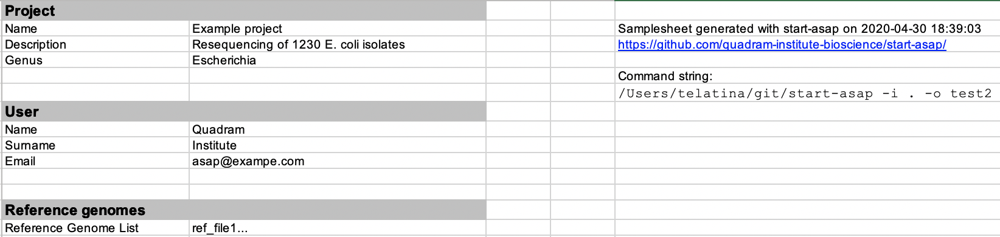
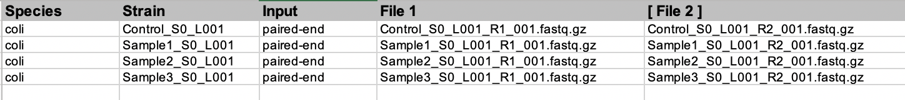

# start-asap

Initialize an ASA³P configuration file in **Excel** format (as required by ASA³P) from the command line. [ASA³P](https://github.com/oschwengers/asap) is a fully featured bacterial assembly and analysis pipeline ([paper](https://journals.plos.org/ploscompbiol/article?id=10.1371/journal.pcbi.1007134)).

### Features
 * Can prepare the ASA³P project directory in a non-interactive way
 * Can use project metadata from a JSON file
 
 
### Usage

See the [documentation](docs/usage.md) page.

### Output

The program can create an Excel file (`config.xls`) in the project directory, and optionally can copy the input files int he correct `./data` subdirectory

The output file contains, as required two workbooks: 

* Project

* Strains

